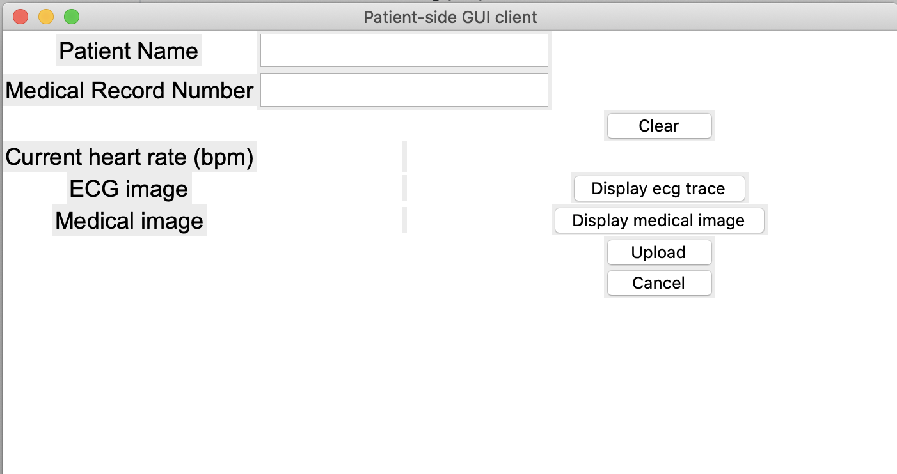
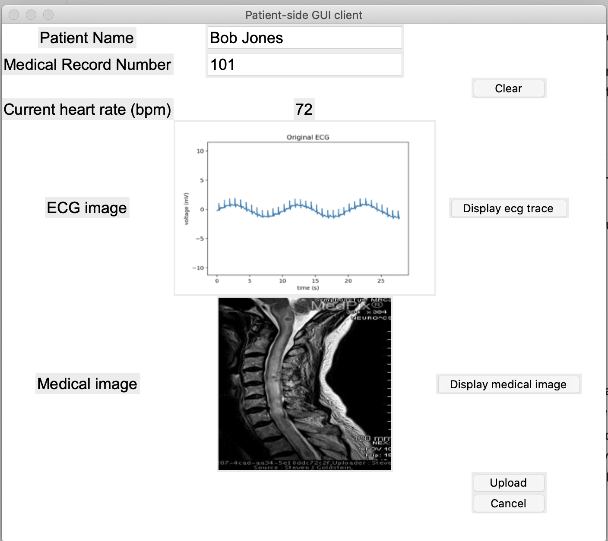
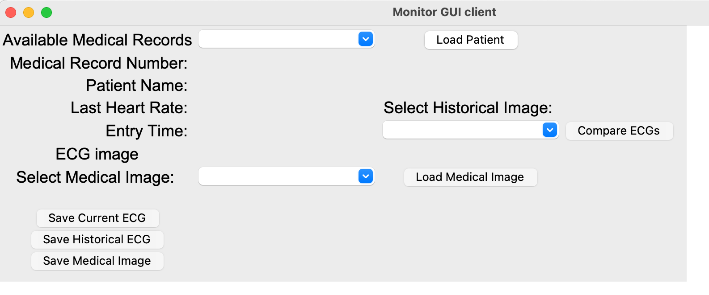

### Patient Monitoring Client/Server Final Project

#### Overview

This is patient monitoring system that has a patient-side client, a monitor-side cleint, and a server/database (using MongoDB) that allows patient data to be uploaded and stored on the server and later retrieved for ad-hoc and continuous monitoring. More specifically, it handles uploading and retrieving medical images, ecg images, and other basic patient fields such as the medical record number, name, and current heart rate.

#### Patient-Side GUI

To use this GUI, the user must enter at least a medical record number of the patient. Upon uploading the information to the server, if a medical record number does not exist in the database, the database will automatically create an entry for the patient.

The user also has the option to enter the Patient Name, which will only be updated once in the database. In addition, the user may also display the ECG trace by the button "display ecg trace", which will prompt user to select a .csv file for the ECG trace. Only .csv files are excepted. Then, the ECG trace is processed and displayed on the GUI along with the current heart rate in BPM. In addition, the user also has the option to display a medical image in the GUI which will only select .jpg images. 

To clear the everything in the GUI and start over, simply press "clear". To send all the information to the cloud server, press upload. To exit the program, hit "cancel". A final screenshot of the GUI completely filled looks like this: 

#### Monitor-Side GUI

To use the monitor-side GUI, select the list of available medical records from the drop down menu. The information will be automatically refreshed periodically and look for new entries to the database. To load and display all of the patient information, select "load patient". Immediately, the medical record number, patient name (if available), last heart rate (if available), entry time (if available), ECG image (if available), list of historical images (if available), and list of medical images (if available) will be pulled up on the GUI. If a new ECG image is pushed to the database while the patient is loaded, the ECG will automatically refresh on the GUI. To display a previous ECG image, choose the list of historical images in the dropdown and select "compare ECGs". To display from the list of medical images, choose the list of medical images in the dropdown and select "load medical image". To save the current ECG image to the computer, select "save current ECG". To save the loaded historical ECG, select "save historical ECG". To save the loaded medical image, select "save medical image". To load a new patient, simply select a new patient from the dropdown menu and press "load patient" again. To exit the program, press the close button on the corner of the window. 

#### Cloud Server

The cloud server accepts upload from the patient side GUI which include the medical record number, the name, medical image, ecg image, and heart rate. It communicates with the MongoDB database for storage and future retrieval. In addition, it also accepts requests from the monitoring station client to retrieve

1. a list of available patient medical record numbers
2. the name and latest heart rate & ECG image for a specific patient
3. a list of ECG Image timestamps for a specific patient
4. a list of medical images for a specific patient
5. a specific ECG Image based on timestamp for a specific patient
6. a specific medical image for a specific patient

In addition, the server is able to properly handle cases in which the medical record number is not already in the database, already in the database, and adding time receipts when ECG image is received.

**Server address: ** http://vcm-17598.vm.duke.edu:5000

Demo video: https://duke.zoom.us/rec/play/WnkNAC5Hfo-yvAfATcY3j4V1nlb0RyZBZ4M-0xCgLOeGMps1l-wGYIM5_dw4e9L1FfVF6FIhqt7IqvTZ.xDJlHwTTlvZimz33?continueMode=true&_x_zm_rtaid=4Gsb7f__RMuWaqzFIBJ_AA.1605503603052.786c5dea991a8a34fed427e1c716daf2&_x_zm_rhtaid=744